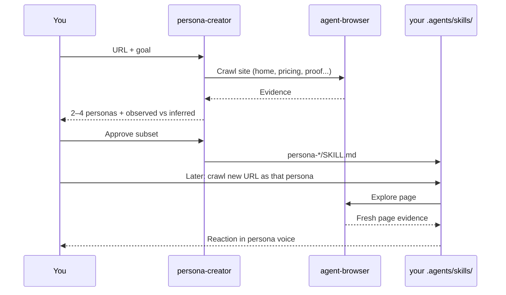

# persona-creator-skills

Agent skills for creating reusable buyer and user persona skills from any website. Skills follow the [Agent Skills](https://agentskills.io/) format.

[](https://skills.sh/radek-baczynski/persona-creator-skills)

## Motivation

We’re bootstrappers building [Transcriptmate](https://transcriptmate.com) — transcription and repurposing for people who live on recordings. We wanted honest feedback on our positioning and landing pages without booking a room full of strangers. So we used AI to stand in for plausible buyers: crawl the site, invent personas with real objections, and argue with our copy before real users do.

We open-sourced `persona-creator` so you can do the same for your product. See [examples/personas/](examples/personas/) for the cast we generated while pressure-testing Transcriptmate — including [persona-solo-creator](examples/personas/persona-solo-creator/).


## How it works

```
You          Analyze https://acme-scheduler.com — who is this really for?

Agent        [crawls home, pricing, use cases, FAQ with agent-browser]

               Site read
               · Product: team scheduling for async companies
               · Pages reviewed: /, /pricing, /for-teams, /customers
               · Strong signals: "engineering leads", per-seat plans, Slack integration

               Candidate personas (waiting for your OK)
               1. persona-engineering-manager     Primary
               2. persona-ops-coordinator           Secondary
               3. persona-freelance-consultant    Speculative

               Approve, merge, rename, or edit before I create skills.

You          Approve 1 and 2. Skip the freelancer.

Agent        [writes to your agent skills directory]
               .agents/skills/persona-engineering-manager/SKILL.md
               .agents/skills/persona-ops-coordinator/SKILL.md
```

### Later — same persona, new page, crawl again

```
You          How would persona-engineering-manager react to our new pricing page?
               https://acme-scheduler.com/pricing-v2

Agent        [loads persona-engineering-manager + crawls the URL with agent-browser]

               Likely reaction
               Cares about seat math and whether managers can see team load at a glance.

               What resonates
               · Clear per-seat tiers on /pricing-v2
               · “Built for engineering teams” on the hero

               What creates friction
               · Vague enterprise tier (“Contact us”)
               · SSO mentioned on /for-teams but not on the pricing page you linked

               Would they move forward?
               Maybe for a pilot — they would still want admin controls spelled out.
```



## persona-creator

Browse a site, propose evidence-backed personas, and after your approval generate reusable `persona-*` research lenses for messaging, UX critique, positioning, and buyer research.

**Use when:**

- You have a product URL and want to know who it is really for
- You want ICPs, buyer profiles, or audience hypotheses grounded in site evidence
- You want reusable persona skills that keep the same buyer lens across later tasks—and can still crawl new pages when you ask

**Example prompts:**

- "Analyze `https://example.com` and tell me who would be most interested in this product."
- "Browse this landing page, propose buyer personas, and after I approve them create reusable persona skills."
- "Look at this SaaS page and make 3 personas I can use later for messaging research."

## Installation

```bash
npx skills add radek-baczynski/persona-creator-skills
```

Pick **one** agent (do not run every line):

**Cursor**

```bash
npx skills add radek-baczynski/persona-creator-skills --skill persona-creator -a cursor -y
```

**Claude Code**

```bash
npx skills add radek-baczynski/persona-creator-skills --skill persona-creator -a claude-code -y
```

**OpenCode**

```bash
npx skills add radek-baczynski/persona-creator-skills --skill persona-creator -a opencode -y
```

**Codex**

```bash
npx skills add radek-baczynski/persona-creator-skills --skill persona-creator -a codex -y
```

**Gemini CLI**

```bash
npx skills add radek-baczynski/persona-creator-skills --skill persona-creator -a gemini-cli -y
```

Add `-g` to install globally. List skills in this repo:

```bash
npx skills add radek-baczynski/persona-creator-skills --list
```

## Dependencies

`persona-creator` expects these skills to be installed separately:

**agent-browser**

```bash
npx skills add vercel-labs/agent-browser --skill agent-browser -y
```

**skill-creator**

```bash
npx skills add anthropics/skills --skill skill-creator -y
```

You also need the `agent-browser` CLI:

```bash
npm i -g agent-browser && agent-browser install
```

## Usage

After installation, mention the site URL and what you want. `persona-creator` crawls supporting pages, proposes personas with evidence anchors, waits for your approval, then writes `persona-*` skills into your agent skills directory (for example `.agents/skills/` on Cursor).

Later, invoke a `persona-*` skill with a URL or question—the persona keeps its lens and can browse new pages with `agent-browser` when needed. Generated skills stay on your machine unless you choose to version them.

## Examples

See [`examples/personas/`](examples/personas/) for sample persona skills produced by `persona-creator`. These are not installable via `npx skills add`.

## Skill structure

Each skill in this repo is a folder under `skills/`:

- `SKILL.md` — instructions and workflow
- `references/` — supporting docs (persona skill template)
- `evals/` — eval cases for quality testing

## Releases

Versioning follows [Semantic Versioning](https://semver.org/). See [CHANGELOG.md](CHANGELOG.md) and [GitHub Releases](https://github.com/radek-baczynski/persona-creator-skills/releases).

Pin a release when installing:

```bash
npx skills add radek-baczynski/persona-creator-skills@v1.0.0 --skill persona-creator -y
```

**Maintainers:** bump `VERSION`, update `CHANGELOG.md` under `[Unreleased]`, run `./scripts/release.sh <version>`, commit, then `git push && git push origin vX.Y.Z`. The [release workflow](.github/workflows/release.yml) publishes notes from the changelog.

## License

MIT
